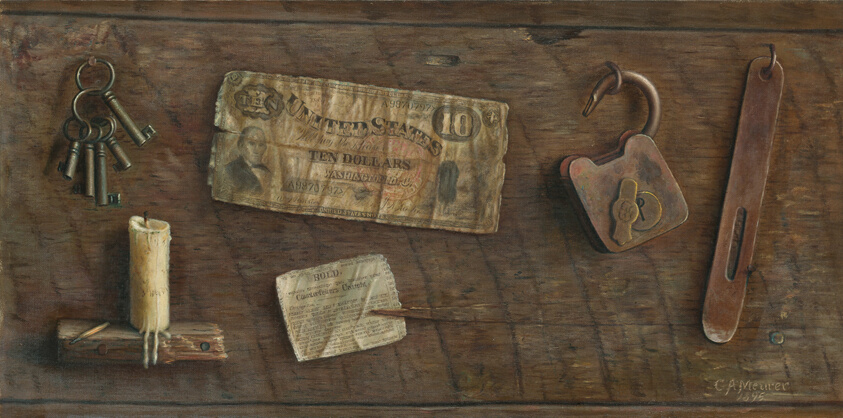

Charles Alfred Meurer, <em>Still Life with Currency</em>, 1895.  Image from the <a href="https://www.artic.edu/artworks/157924/still-life-with-currency">Art Institute of Chicago</a>.

## Disclaimer {.unnumbered}

This set of notes is a work in progress. It may have errors and be
missing citations. It is certainly incomplete. Please let the staff
know of any errors that you find.

## Contributors {.unnumbered}

These notes are based on lectures by the 6.1600 course staff:

- **2024:** Srini Devadas and Yael Kalai
- **2023:** Henry Corrigan-Gibbs and Nickolai Zeldovich
- **2022:** Henry Corrigan-Gibbs, Yael Kalai, and Nickolai Zeldovich.
- **2021:** Henry Corrigan-Gibbs, Srini Devadas, Yael Kalai, and Nickolai Zeldovich.

Ben Kettle, our course TA in 2022, was responsible for transcribing
the first set of these lecture notes in Fall 2022.
